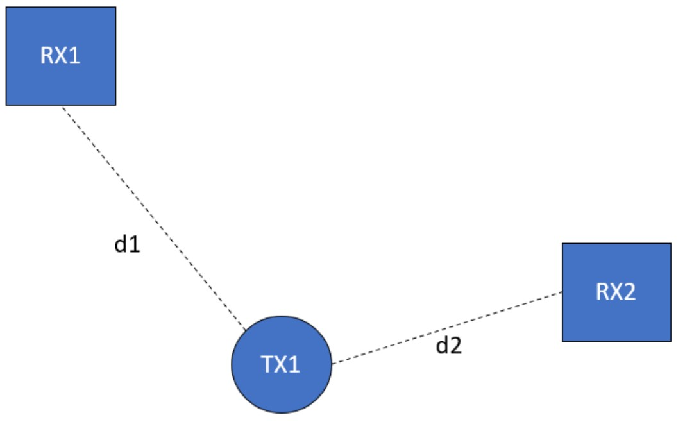

# Notes on Sample Rate and TOA Accuracy

The goal of this writeup is to investigate the effect of sampling rate on the accuracy localization using time difference of arrival (TDOA) measurements. 

Consider a system with two receivers and a single transmitter as seen below. The receivers have some sampling rate $f_s$ and are distances $d_1$ and $d_2$ away from the transmitter. We define time $t=0s$ as the exact instant that the transmitter turns on, $t=t_1$ as the instant the signal reaches receiver 1, and $t=t_2$ as the time that the signal reaches receiver 2.  

Because each receiver is sampling at $f_s$ they measure arrival times in integer multiples of the sampling rate. Then $t_1 = n_1 / f_s$ and $t_2 = n_2 / f_s$ where $n_1$ and $n_2$ are positive integers. This means that the TDOA  measurement must also be some integer multiple of the sampling time $TDOA = \left| \frac{n_2-n_1}{f_s} \right|$. 

The speed of light is $c=3\times 10^8$ m/s. This means the transmit signal travels a distance of $1$ meter in $\Delta t=\frac{1}{3\times 10^8}\frac{m}{m/s} \approx 3.33$ ns. 

The max sample rate of our USRP radios is 100 MHz. So the fastes we can collect samples is $1/f_s = 10 ns$.  

The TDOA between two recievers is defined as: 
$$TDOA = |t_2-t_1|$$
$$TDOA = \left|\frac{d_2}{c}-\frac{d_1}{c}\right|$$
$$TDOA = \left|\frac{d_2-d_1}{c}\right|$$

The Range differnce (RD) is defined as:
$$RD = \left|d_2-d_1\right| = c \times TDOA$$

With a 100 Mhz sample rate the minimum TDOA is 10 ns which corresponds to minimum detectable RD of 3 meters. 

So we can define the min TDOA and min RD based on the recieved sampling rate:
$$TDOA_{min} = \frac{1}{f_s}$$
$$RD_{min} = c \times TDOA_{min} = \frac{c}{f_s}$$

