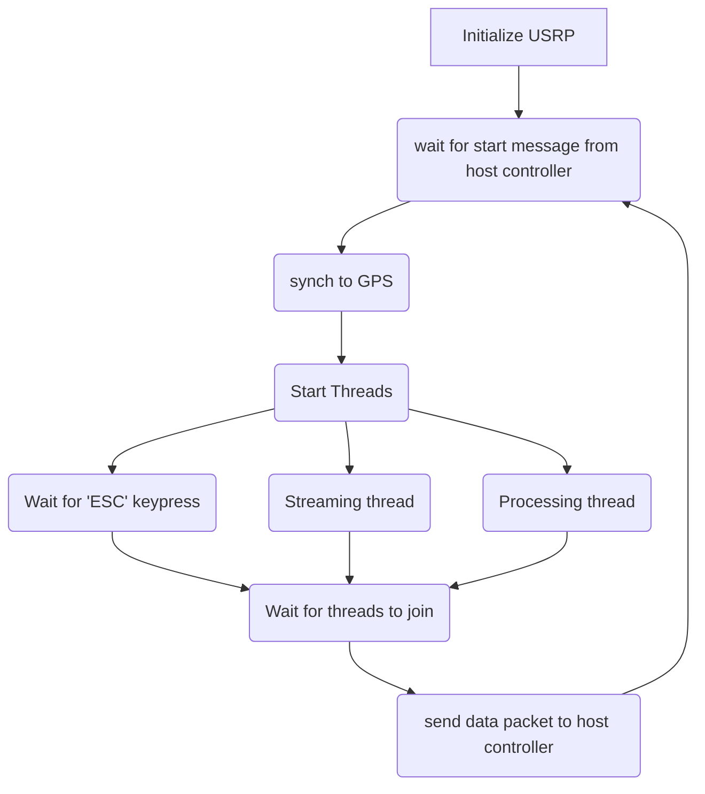
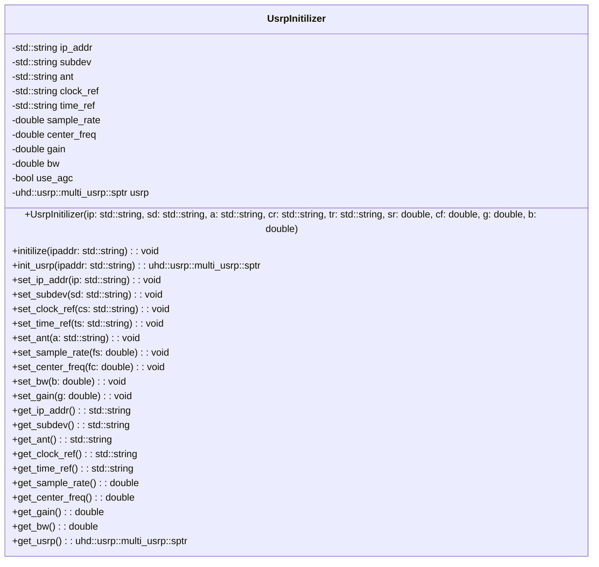

```mermaid
graph TD
A[Initialize USRP] --> B(wait for start message from host controller)
B --> C(synch to GPS)
C --> D(Start Threads)
D --> E(Wait for 'ESC' keypress)
D --> F(Streaming thread)
D --> G(Processing thread)
E --> I(Wait for threads to join)
F --> I
G --> I
I --> J(send data packet to host controller)
J --> B
```

```mermaid
classDiagram
    class UsrpInitilizer {
        -std::string ip_addr
        -std::string subdev
        -std::string ant
        -std::string clock_ref
        -std::string time_ref
        -double sample_rate
        -double center_freq
        -double gain
        -double bw
        -bool use_agc
        -uhd::usrp::multi_usrp::sptr usrp
        +UsrpInitilizer(ip: std::string, sd: std::string, a: std::string, cr: std::string, tr: std::string, sr: double, cf: double, g: double, b: double)
        +initilize(ipaddr: std::string): void
        +init_usrp(ipaddr: std::string): uhd::usrp::multi_usrp::sptr
        +set_ip_addr(ip: std::string): void
        +set_subdev(sd: std::string): void
        +set_clock_ref(cs: std::string): void
        +set_time_ref(ts: std::string): void
        +set_ant(a: std::string): void
        +set_sample_rate(fs: double): void
        +set_center_freq(fc: double): void
        +set_bw(b: double): void
        +set_gain(g: double): void
        +get_ip_addr(): std::string
        +get_subdev(): std::string
        +get_ant(): std::string
        +get_clock_ref(): std::string
        +get_time_ref(): std::string
        +get_sample_rate(): double
        +get_center_freq(): double
        +get_gain(): double
        +get_bw(): double
        +get_usrp(): uhd::usrp::multi_usrp::sptr
    }

```
