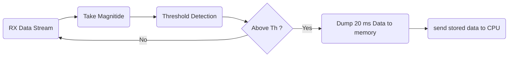
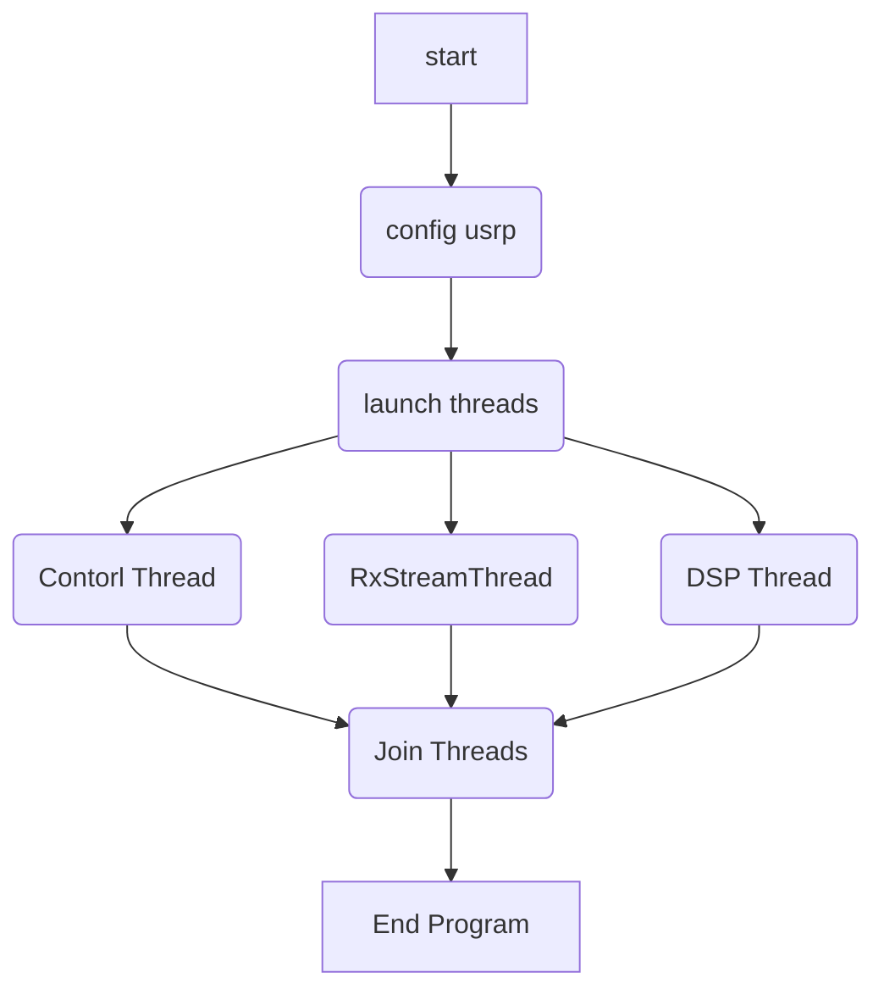
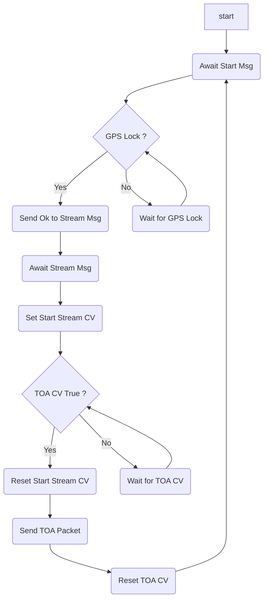
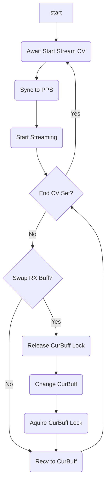
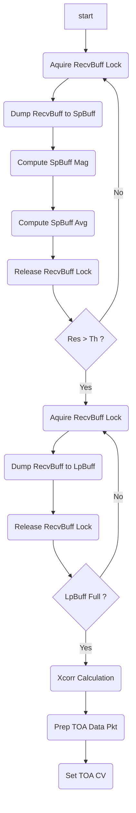
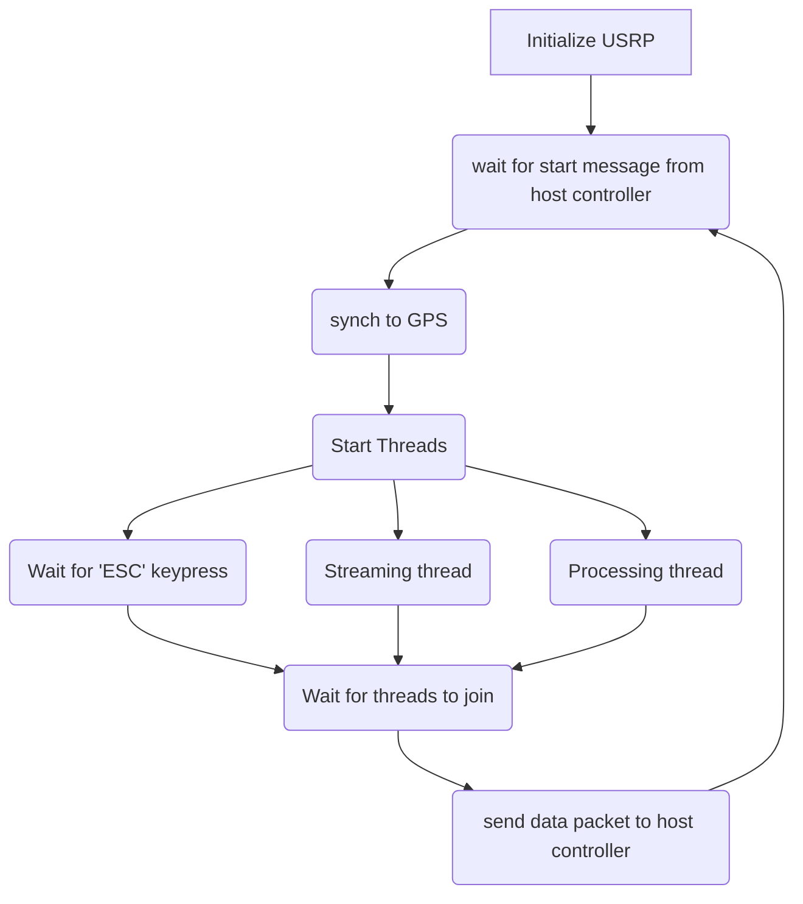
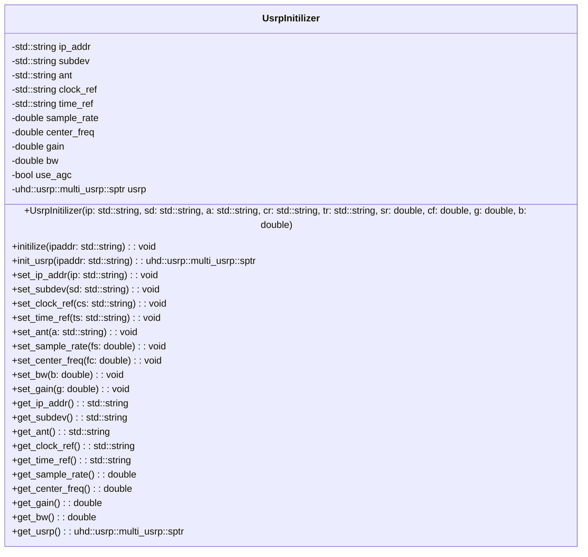

## DSP General Flowchart

```mermaid
graph LR
A(RX Data Stream)-->B(Take Magnitide)
B--> D(Threshold Detection)
D --> E{Above Th ?}
E --> |Yes| F(Dump 20 ms Data to memory)
E --> |No| A
F --> G(send stored data to CPU)
```

## Host main.cpp flowchart

```mermaid
graph TD
A[start]--> B(config usrp)
B --> C(launch threads)
C --> D(Contorl Thread)
C --> E(RxStreamThread)
C --> F(DSP Thread)
D --> G(Join Threads)
E --> G
F --> G
G --> H[End Program]
```

## Control Thread

```mermaid
graph TD
A[start] --> B(Await Start Msg)
B --> C{GPS Lock ?}
C --> |Yes| D(Send Ok to Stream Msg)
C --> |No| E(Wait for GPS Lock)
E --> C
D --> F(Await Stream Msg)
F --> G(Set Start Stream CV)
G --> H{TOA CV True ?}
H --> |Yes| I(Reset Start Stream CV)
H --> |No| J(Wait for TOA CV)
J --> H
I --> K(Send TOA Packet)
K --> L(Reset TOA CV)
L --> B
```

## Streaming Thread

```mermaid
graph TD
A[start] --> B(Await Start Stream CV)
B --> C(Sync to PPS)
C --> D(Start Streaming)
D --> E{End CV Set?}
E --> |Yes| B
E --> |No| F{Swap RX Buff?}
F --> |Yes| G(Release CurBuff Lock)
F --> |No| H(Recv to CurBuff)
H --> E
G --> I(Change CurBuff)
I --> J(Aquire CurBuff Lock)
J --> H
```

## DSP Thread

```mermaid
graph TD
A[start] --> B(Aquire RecvBuff Lock)
B --> C(Dump RecvBuff to SpBuff)
C --> D(Compute SpBuff Mag)
D --> E(Compute SpBuff Avg)
E --> EE(Release RecvBuff Lock)
EE --> F{Res > Th ?} 
F --> |Yes| G(Aquire RecvBuff Lock)
F --> |No| B
G --> H(Dump RecvBuff to LpBuff)
H --> I(Release RecvBuff Lock)
I --> J{LpBuff Full ?}
J --> |Yes| K(Xcorr Calculation)
J --> |No| G
K --> L(Prep TOA Data Pkt)
L --> M(Set TOA CV)
```

## Old Diagrams

```mermaid
graph TD
A[Initialize USRP] --> B(wait for start message from host controller)
B --> C(synch to GPS)
C --> D(Start Threads)
D --> E(Wait for 'ESC' keypress)
D --> F(Streaming thread)
D --> G(Processing thread)
E --> I(Wait for threads to join)
F --> I
G --> I
I --> J(send data packet to host controller)
J --> B
```

```mermaid
classDiagram
    class UsrpInitilizer {
        -std::string ip_addr
        -std::string subdev
        -std::string ant
        -std::string clock_ref
        -std::string time_ref
        -double sample_rate
        -double center_freq
        -double gain
        -double bw
        -bool use_agc
        -uhd::usrp::multi_usrp::sptr usrp
        +UsrpInitilizer(ip: std::string, sd: std::string, a: std::string, cr: std::string, tr: std::string, sr: double, cf: double, g: double, b: double)
        +initilize(ipaddr: std::string): void
        +init_usrp(ipaddr: std::string): uhd::usrp::multi_usrp::sptr
        +set_ip_addr(ip: std::string): void
        +set_subdev(sd: std::string): void
        +set_clock_ref(cs: std::string): void
        +set_time_ref(ts: std::string): void
        +set_ant(a: std::string): void
        +set_sample_rate(fs: double): void
        +set_center_freq(fc: double): void
        +set_bw(b: double): void
        +set_gain(g: double): void
        +get_ip_addr(): std::string
        +get_subdev(): std::string
        +get_ant(): std::string
        +get_clock_ref(): std::string
        +get_time_ref(): std::string
        +get_sample_rate(): double
        +get_center_freq(): double
        +get_gain(): double
        +get_bw(): double
        +get_usrp(): uhd::usrp::multi_usrp::sptr
    }

```
