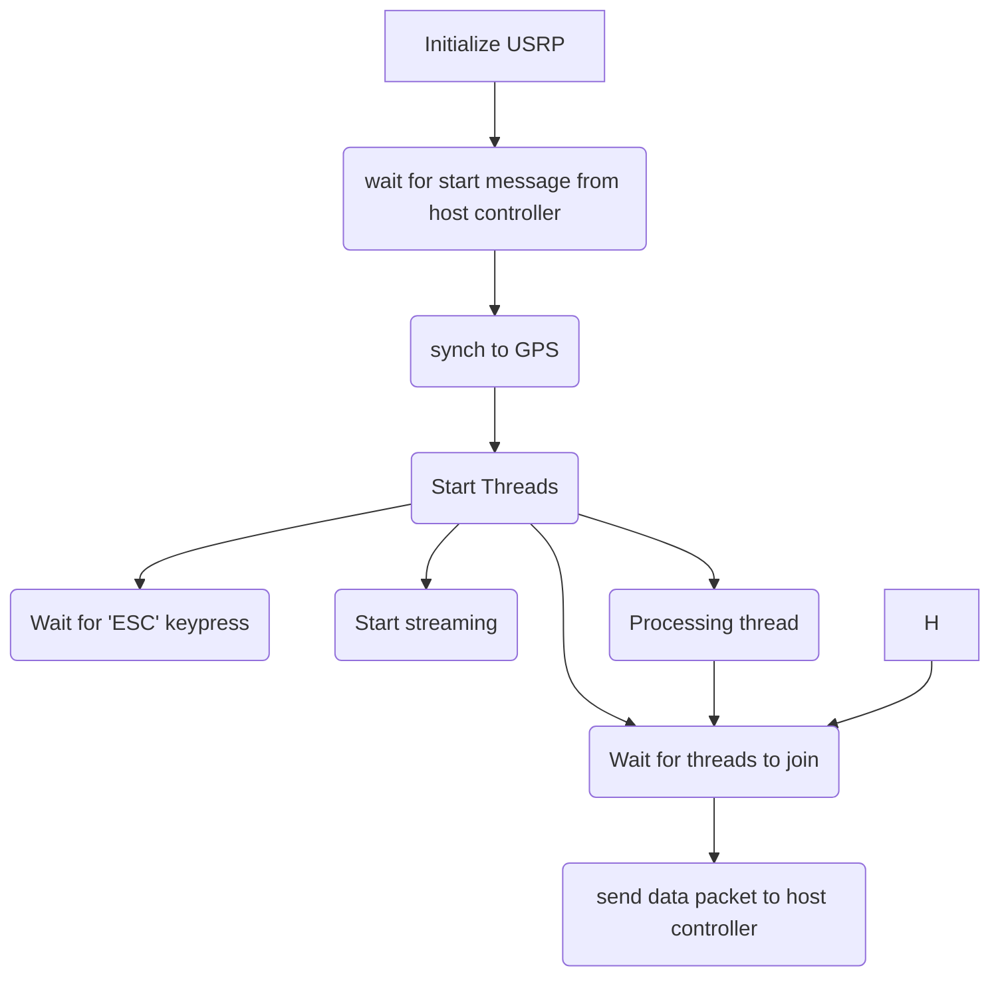

# DSP source code

Here I will test dsp algorithms using the UHD c++ api. 

note I also use the gnuplot library to help me visualize what I am doing. 

to install gnuplot use these commands:

```
sudo apt-get install gnuplot
sudo apt-get install libgnuplot-iostream-dev
```
 then you can use gnuplot in your c++ programs by incliding it:
 ```
 #include <gnuplot-iostream.h>
 ```



